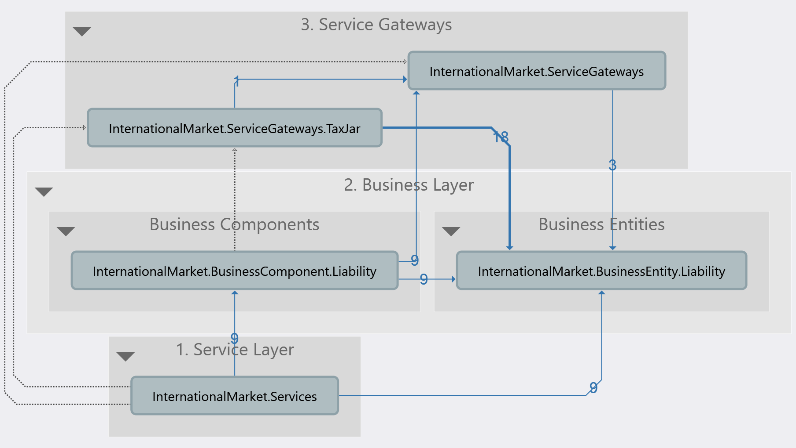

# InternationalMarket.Services
###### We use a lot of external services and API's to accommodate our customers' needs.  One of them is Tax calculation.  There are a lot of Tax calculation API’s out there and we need to be able to work with many of them via a common interface we define in a service class.

**Requirement**
###### Create a Tax Service that can take a Tax Calculator in the class initialization and return the total tax that needs to be collected.
###### We are only going to be talking to their SalesTax API: https://developers.taxjar.com/api/reference/#sales-tax-api
###### The client you need to write for Tax Jar only needs to include a couple of methods:
* Get the Tax rates for a location
* Calculate the taxes for an order

###### We are going to use Tax Jar as one of our calculators.  You will need to write a .Net client to talk to their API, do not use theirs.  
###### The Tax Service will also have these methods and simply call the Tax Calculator.  Eventually we would have several Tax Calculators and the Tax Service would need to decide which to use based on the Customer that is consuming the Tax Service. 

# Architectural Diagram

# Minimal Requirements documentation
* Decide on internal canonical Tax representation in the system
* Implement central DI strategy
* Implement central cross cutting concerns
* Decide on api auth strategy for different integrations